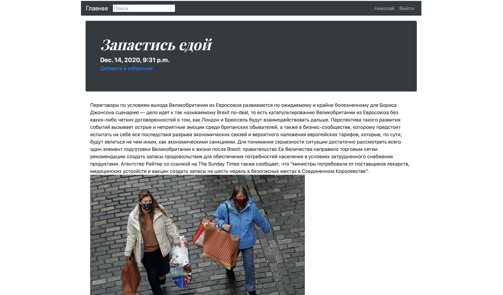
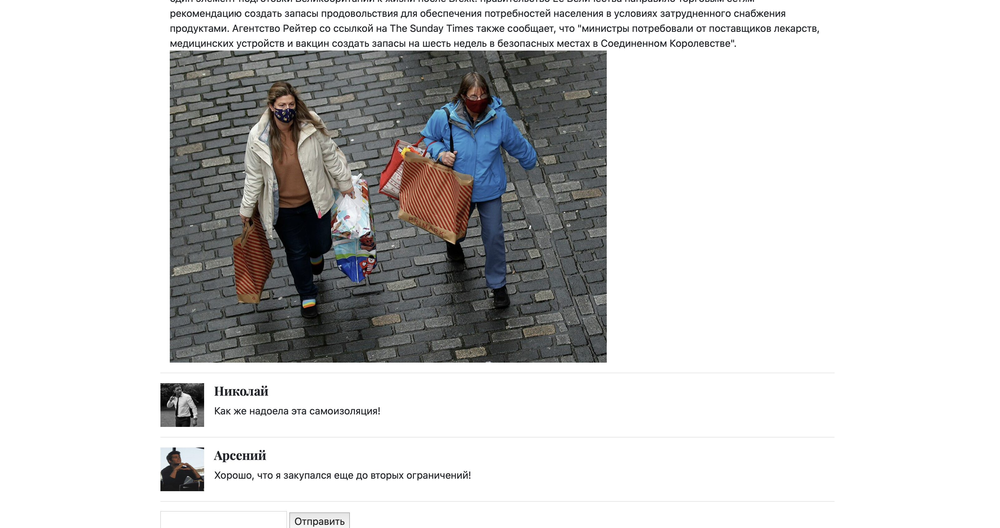
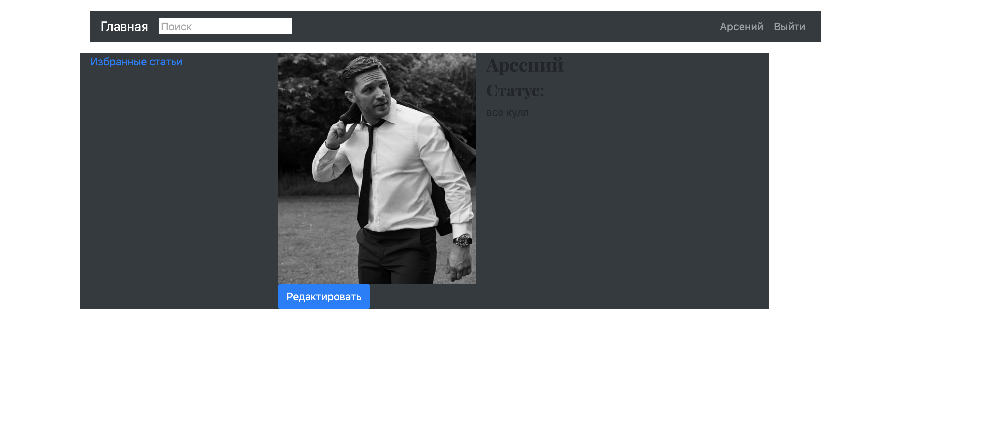
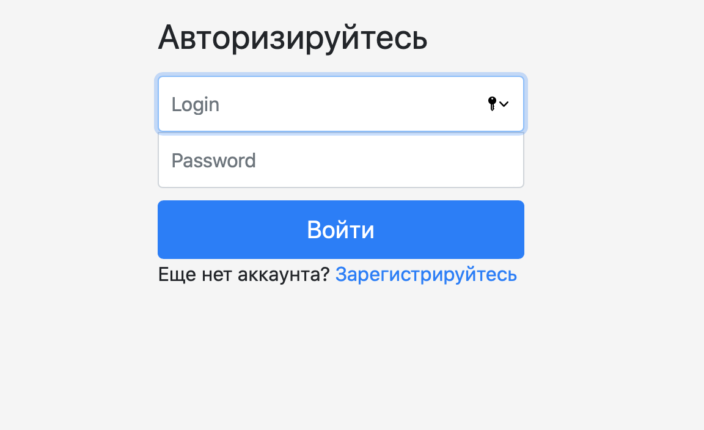
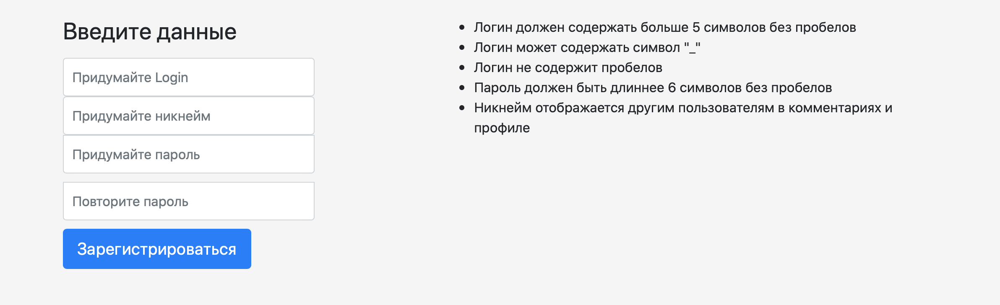
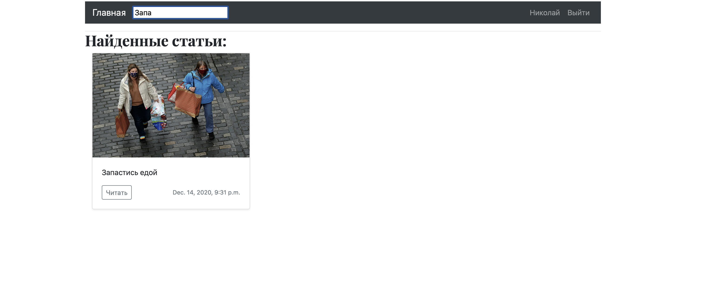

## Django блог 

Тестовый проект с использованием технологий: 

- Django 3.1.1
- Docker 19.03.12
- docker-compose
- PostgreSQL 
- Python 3.8


 
> В проекте используется технология **Docker** , для успешного открытия   
	у вас должен быть установлен Docker на вашей машине.  see https://docs.docker.com/get-started/. 

```1. git clone https://github.com/Mejay013/Django_blog.git ``` 

```2. cd Django_blog``` 

```2. docker-compose build``` 

```2. docker-compose up``` 

## Функционал


1. Перейти  ```localhost:8000```

На гланой странице можно увидеть различные статьи блога и краткую информацию. 

​ 

Есть вохможность прочитать статью более подробнее: 

​  
 
 Каждый пользователь может добавлять статью в избранное и комментировать её:
 
​ 

Нажав на аватар в комментарии можно перейти на личный профиль пользователя, в котором есть: 
1. Аватар пользователя 
2. Логин пользователя 
3. Статус пользователя 
4. Избранные статьи пользователя 
5. Кнопка "Редактировать", позволяющая изменять аватар и статус пользователя 
 
​ 

Возможность создания нового профиля/авторизации пользователя 

​ 
​ 

Присутствует возможность поиска по статьям. 
 
​  
